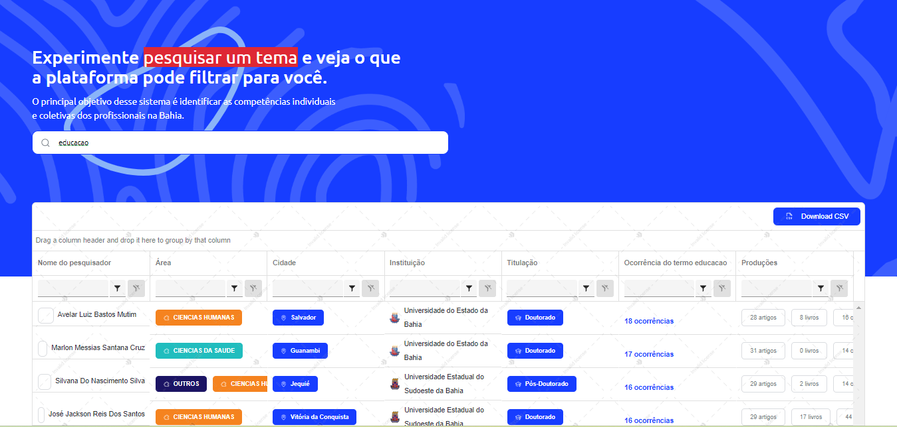

# React + TypeScript + Vite

INSTRUÇÕES PARA USO

1. npm install
2. npm run dev

INFORMAÇÕES 

é uma plataforma de teste foi desenvolvida com o objetivo de auxiliar na seleção e filtragem de pesquisadores. Esta plataforma tem o potencial facilitar o processo de identificação e escolha dos profissionais mais qualificados em suas respectivas áreas de atuação.

O back extrai dos dados do web service do CNPq, referente a todos os pesquisadores das Universidades Estaduais da Bahia,  e com o Apache Hop e Postgre, faz-se o banco de dados. Nesse exemplo, está sendo consumido através do ip "http://200.128.66.226:8080/"

Para esse projeto foi utilizado no front-end: React js, Vite, Typescript, Tailwindcss, Kendo UI

Utilizou-se conceitos de responsividade e ux/ui design

